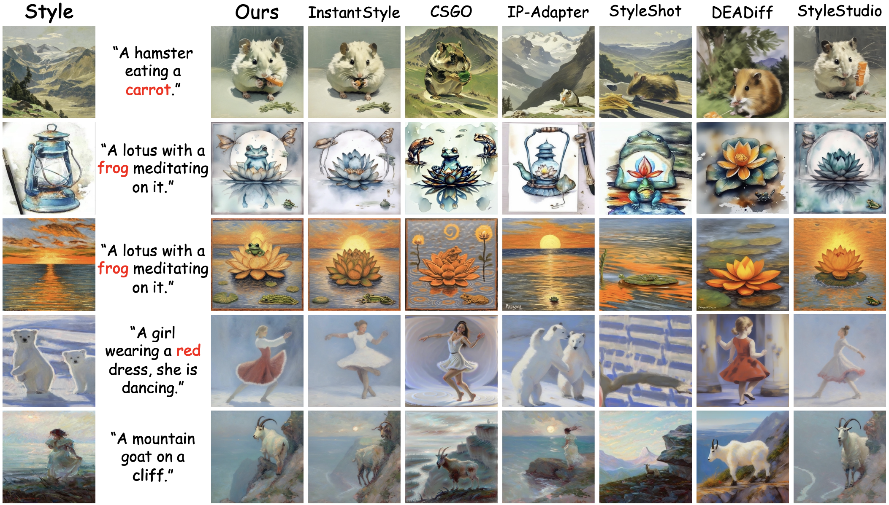
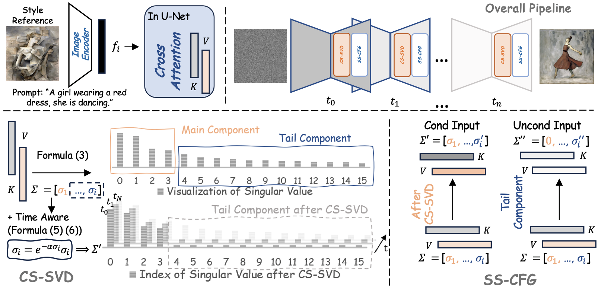
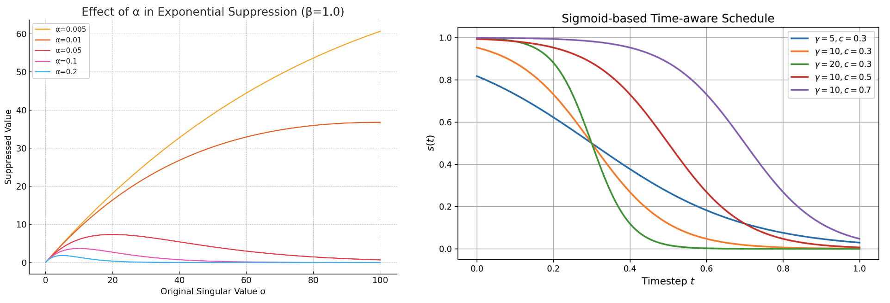

<p align="center">
  <h1 align="center">
  CleanStyle: Plug-and-Play Style Conditioning Purification for Text-to-Image Stylization<br>
  </h1>
  <p align="center">
    <a href=""><strong>Xiaoman Feng</strong></a><sup>*</sup>
    &nbsp;&nbsp;
    <a href="https://mingkunlei.github.io"><strong>Mingkun Lei</strong></a><sup>*</sup>
    &nbsp;&nbsp;
    <a href=""><strong>Yang Wang</strong></a>    
    &nbsp;&nbsp;
    <a href=""><strong>Dingwen Fu</strong></a>
    &nbsp;&nbsp;
    <a href="https://icoz69.github.io/"><strong>Chi Zhang</strong></a><sup>✉</sup>
    <br>
    AGI Lab, Westlake University,</span>&nbsp;
    <br>
    * equal contribution, ✉ corresponding author
    <br>
    <a href='https://arxiv.org/abs/2602.20721'></a>&nbsp;
    <br>
    
  </p>
  <br>
</p>

## News and Update
- __[2026.2.24]__ 🔥 We release the code and paper.

## Abstract
Style transfer in diffusion models enables controllable visual generation by injecting the style of a reference image. However, recent encoder-based methods, while efficient and tuning-free, often suffer from content leakage, where semantic elements from the style image undesirably appear in the output, impairing prompt fidelity and stylistic consistency.
In this work, we introduce **CleanStyle**, a plug-and-play framework that filters out content-related noise from the style embedding without retraining. Motivated by empirical analysis, we observe that such leakage predominantly stems from the tail components of the style embedding, which are isolated via Singular Value Decomposition (SVD). To address this, we propose CleanStyleSVD (CS-SVD), which dynamically suppresses tail components using a time-aware exponential schedule, providing clean, style-preserving conditional embeddings throughout the denoising process.
Furthermore, we present Style-Specific Classifier-Free Guidance (SS-CFG), which reuses the suppressed tail components to construct style-aware unconditional inputs.
Unlike conventional methods that use generic negative embeddings (e.g., zero vectors), SS-CFG introduces targeted negative signals that reflect style-specific but prompt-irrelevant visual elements.
This enables the model to effectively suppress these distracting patterns during generation, thereby improving prompt fidelity and enhancing the overall visual quality of stylized outputs.
Our approach is lightweight, interpretable, and can be seamlessly integrated into existing encoder-based diffusion models without retraining. Extensive experiments demonstrate that CleanStyle substantially reduces content leakage, improves stylization quality and improves prompt alignment across a wide range of style references and prompts.

## Getting Started
### 1.Clone the code and prepare the environment
```bash
git clone https://github.com/Westlake-AGI-Lab/CleanStyle.git
cd CleanStyle

# create env using conda
conda create -n CleanStyle python=3.10
conda activate CleanStyle

# install dependencies with pip
pip install -r requirements.txt
```

### 2.Run CleanStyle

Please note: Our solution is designed to be **fine-tuning free** and can be combined with different methods.

#### Parameter Explanation


```
hyper:
  encoder_svd: false   # optional (apply on encoder features)
  encoder_cfg: false
  attn_svd: true       # default (apply on attention K/V)
  attn_cfg: true
  guidance_scale: 7.5  # standard CFG scale

  attn_svd_k: 1        # top-k kept components
  attn_svd_alpha: 0.01 # tail suppression strength

  attn_svd_gamma: 20.0 # time-aware (Eq. 5/6): sharpness
  attn_svd_center: 0.3 # time-aware (Eq. 5/6): center in [0,1]
```
Tips: start with defaults. If leakage remains, increase `attn_svd_alpha`; if details degrade, decrease `alpha` or increase `attn_svd_k`. We visualize the effect of hyper-parameters (e.g., gamma, center) in the figure below.



#### Integration with InstantStyle
Follow [InstantStyle](https://github.com/instantX-research/InstantStyle) to download pre-trained checkpoints.
```bash
cd InstantStyle

python run.py --config example.yaml
```

#### Integration with StyleShot
Follow [StyleShot](https://github.com/open-mmlab/StyleShot) to download pre-trained checkpoints.

```bash
cd StyleShot

python run.py --config example.yaml
```


## Related Links
* [Style Transfer with Diffusion Models](https://github.com/MingkunLei/Awesome-Style-Transfer-with-Diffusion-Models): A paper collection of recent style transfer methods with diffusion models.
* [StyleStudio: Text-Driven Style Transfer with Selective Control of Style Elements](https://github.com/Westlake-AGI-Lab/StyleStudio)
* [CSGO: Content-Style Composition in Text-to-Image Generation](https://github.com/instantX-research/CSGO)
* [InstantStyle: Free Lunch towards Style-Preserving in Text-to-Image Generation](https://github.com/instantX-research/InstantStyle)
* [StyleShot](https://github.com/open-mmlab/StyleShot)
* [IP-Adapter: Text Compatible Image Prompt Adapter for Text-to-Image Diffusion Models](https://github.com/tencent-ailab/IP-Adapter)

## BibTeX
If you find our repo helpful, please consider leaving a star or cite our paper :)
```bibtex
@misc{cleanstyle,
      title={CleanStyle: Plug-and-Play Style Conditioning Purification for Text-to-Image Stylization}, 
      author={Xiaoman Feng and Mingkun Lei and Yang Wang and Dingwen Fu and Chi Zhang},
      year={2026},
      eprint={2602.20721},
      archivePrefix={arXiv},
      primaryClass={cs.CV},
      url={https://arxiv.org/abs/2602.20721}, 
}
```


## 📭 Contact
If you have any comments or questions, feel free to contact [Xiaoman Feng](22723050@bjtu.edu.cn) and [Mingkun Lei](leimingkun@westlake.edu.cn).
